  

  

  
  
  
  
  

 

<table align="center">
  <tr>
    <td width="55%">
      <h3> Decoding the Digital Frontier</h3>
      
I am a <b>CREATIVE SOFTWARE ENGINEER</b> with an obsession for building elite-level web experiences. I specialize in merging advanced geometry, smooth animations, and robust system design to create digital masterpieces that leave a lasting impression.

      <ul>
        <li>🧬 Expert in <b>3D Web Development</b> using <b>Three.js</b> and <b>GLSL</b>.</li>
        <li>✨ Master of <b>GSAP</b>, <b>Framer Motion</b>, and <b>Lenis</b> for high-end UX.</li>
        <li>🛠️ Architect of scalable <b>Next.js</b> and <b>Full-Stack</b> ecosystems.</li>
        <li>💻 Working on a <b>Pink MacBook Pro</b> to bring vision to life.</li>
      </ul>
    </td>
    <td width="45%" align="center">
      
    </td>
  </tr>
</table>

---

###  Arsenal & Core Tech

  

 

---

###  Digital Masterpieces (Featured Repos)

  <table>
    <tr>
      <td>
        
      </td>
      <td>
        
      </td>
    </tr>
    <tr>
      <td>
        
      </td>
      <td>
        
      </td>
    </tr>
  </table>

---

###  Vital Signs (GitHub Pulse)

  
  

  

 

---

###  Contribution Bubbles

  

---

  

 

  

   
  <i>Connecting Vision with High-Performance Reality.</i>
   
  <b>Thank you for visiting my profile! Let's build something extraordinary. 🚀</b>
   
   
  

