

  

  

  
  
  
  
  
  
  
  

 

<table align="center">
  <tr>
    <td width="55%">
      <h3> Decoding the Digital Frontier</h3>
      
I am a <b>CREATIVE SOFTWARE ENGINEER</b> with an obsession for building elite-level web experiences. I specialize in merging advanced geometry, smooth animations, and robust system design to create digital masterpieces that leave a lasting impression.

      <ul>
        <li>🧬 Expert in <b>3D Web Development</b> using <b>Three.js</b> and <b>GLSL</b>.</li>
        <li>✨ Master of <b>GSAP</b>, <b>Framer Motion</b>, and <b>Lenis</b> for high-end UX.</li>
        <li>🛠️ Architect of scalable <b>Next.js</b> and <b>Full-Stack</b> ecosystems.</li>
        <li>💻 Working on a <b>Pink MacBook Pro</b> to bring vision to life.</li>
      </ul>
    </td>
    <td width="45%" align="center">
      
    </td>
  </tr>
</table>

---

###  Arsenal & Core Tech

  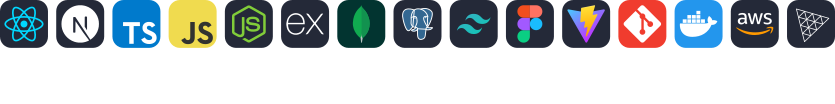

 

---

### 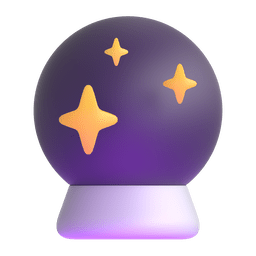 Digital Masterpieces (Featured Repos)

  <a href="https://github.com/wajihacodeofficial/PakChat"></a>
  <a href="https://github.com/wajihacodeofficial/Medify-WebApp"></a>

  <a href="https://github.com/wajihacodeofficial/BiteDash"></a>
  <a href="https://github.com/wajihacodeofficial/Stock-Pro"></a>

 

---

###  Vital Signs (GitHub Pulse)

  
  

  

 

---

### ✨ Contribution Activity

  

---

###  GitHub Achievements

   
  <table>
    <tr>
      <td align="center">
        
         
        <b>Pull Shark</b>
      </td>
      <td align="center">
        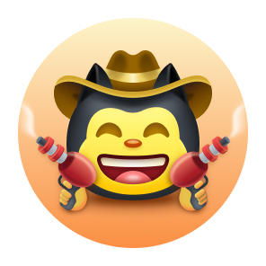
         
        <b>Quickdraw</b>
      </td>
      <td align="center">
        
         
        <b>YOLO</b>
      </td>
    </tr>
  </table>

---

### 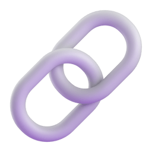 Life Tracker

  <table>
    <tr>
      <td> <b>Tea Drinked:</b></td>
      <td><code>21,900</code> cups.</td>
    </tr>
    <tr>
      <td> <b>Lines of Code Written:</b></td>
      <td><code>547,500</code></td>
    </tr>
    <tr>
      <td>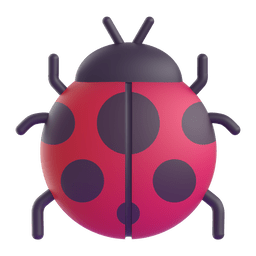 <b>Squashed Bugs:</b></td>
      <td><code>3,750</code></td>
    </tr>
    <tr>
      <td> <b>Thinking Time:</b></td>
      <td><code>80,300</code> hours.</td>
    </tr>
    <tr>
      <td>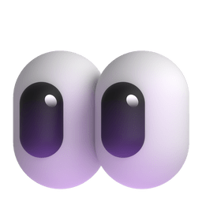 <b>Total Views:</b></td>
      <td><code>22,530</code></td>
    </tr>
    <tr>
      <td> <b>Projects Completed:</b></td>
      <td><code>20</code></td>
    </tr>
    <tr>
      <td>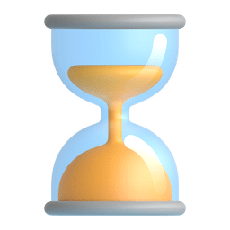 <b>Daily Working Hours:</b></td>
      <td><code>~ 8 Hours</code></td>
    </tr>
  </table>

---

###  How I Spend My Free Time

  <table>
    <tr>
      <td>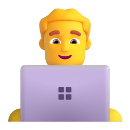 <b>Coding</b></td>
    </tr>
    <tr>
      <td>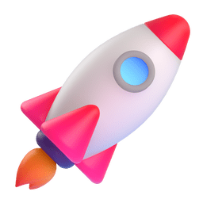 <b>Open-source Contributions</b></td>
    </tr>
    <tr>
      <td> <b>Reading Tech Blogs & Books</b></td>
    </tr>
    <tr>
      <td> <b>Puzzle Solving / Algorithm Challenges</b></td>
    </tr>
    <tr>
      <td>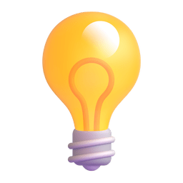 <b>Learning New Frameworks & Languages</b></td>
    </tr>
    <tr>
      <td>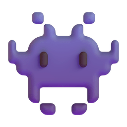 <b>AI Experiments / Side Projects</b></td>
    </tr>
  </table>

---

  

 

  

   
  <i>Connecting Vision with High-Performance Reality.</i>
   
  <b>Thank you for visiting my profile! Let's build something extraordinary. 🚀</b>
   
   
  

