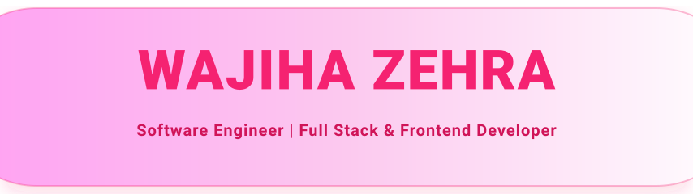
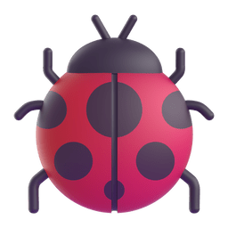

  

  

  
  
  
  
  

 

<table align="center">
  <tr>
    <td width="55%">
      <h3> About Me</h3>
      
I am <b>Wajiha Zehra</b>, a <b>Software Engineer & Full Stack Developer</b> (BS Software Engineering, Iqra University 2023–Present). I specialize in building modern, high-performance web applications with clean code, scalable architecture, and delightful user experiences.

      <ul>
        <li>🚀 <b>Live Portfolio</b>: <a href="https://wajihazehra.dev">wajihazehra.dev</a></li>
        <li>💻 <b>Core Expertise</b>: React.js, TypeScript, JavaScript, Node.js, Express, MongoDB, PostgreSQL, Tailwind CSS.</li>
        <li>💡 <b>Mindset</b>: Creative thinking, analytical problem solving, and attention to detail.</li>
        <li>📍 Based in <b>Karachi, Pakistan</b> — open for engineering roles and collaborations.</li>
      </ul>
    </td>
    <td width="45%" align="center">
      
    </td>
  </tr>
</table>

---

###  Tech Stack & Arsenal

  

 

  <code>React.js</code> • <code>TypeScript</code> • <code>JavaScript</code> • <code>Node.js</code> • <code>Express.js</code> • <code>MongoDB</code> • <code>PostgreSQL</code> • <code>Tailwind CSS</code> • <code>Framer Motion</code> • <code>REST APIs</code> • <code>Vite</code> • <code>Git/GitHub</code>

---

###  Featured Projects

<table align="center">
  <tr>
    <td width="50%" valign="top">
      <h4>🤖 <a href="https://clientpilotai.rehanhussain.dev/">ClientPilot AI</a> </h4>
      
<b>React.js • Node.js • AI & LLMs • MongoDB • Tailwind CSS</b>

      
AI-powered client acquisition platform that discovers businesses, analyzes their digital presence, identifies real opportunities, and helps agencies win high-ticket clients.

      
🔗 <a href="https://clientpilotai.rehanhussain.dev/"><b>Live Demo</b></a> • <a href="https://github.com/wajihacodeofficial">GitHub</a>

    </td>
    <td width="50%" valign="top">
      <h4>🍔 <a href="https://bitedash.rehanhussain.dev/">BiteDash</a> </h4>
      
<b>React.js • Node.js • Express.js • MongoDB • Tailwind CSS</b>

      
On-demand food delivery web application connecting customers to top-tier verified restaurants featuring lightning-fast ordering, dynamic menus, and real-time tracking.

      
🔗 <a href="https://bitedash.rehanhussain.dev/"><b>Live Demo</b></a> • <a href="https://github.com/wajihacodeofficial">GitHub</a>

    </td>
  </tr>
  <tr>
    <td width="50%" valign="top">
      <h4>✨ <a href="https://nidasalon-demo.vercel.app/">Nida's Salon</a> </h4>
      
<b>React.js • TypeScript • Tailwind CSS • Framer Motion</b>

      
Where Elegance Meets Artistry — an upscale beauty salon platform featuring seamless appointment scheduling, luxury service showcase, and an interactive customer experience.

      
🔗 <a href="https://nidasalon-demo.vercel.app/"><b>Live Demo</b></a> • <a href="https://github.com/wajihacodeofficial">GitHub</a>

    </td>
    <td width="50%" valign="top">
      <h4>🎀 <a href="https://wajihazehra.dev">Personal Portfolio (wajihazehra.dev)</a></h4>
      
<b>React • TypeScript • Tailwind CSS v4 • Framer Motion</b>

      
High-performance personal portfolio featuring dual-persona design system (Soft Girl & Cool Noir Baddie), 3D flipping ID card, verified LinkedIn recommendations, and live GitHub insights.

      
🔗 <a href="https://wajihazehra.dev"><b>Live Portfolio</b></a> • <a href="https://github.com/wajihacodeofficial/wajihaportfolio">Source Code</a>

    </td>
  </tr>
</table>

---

###  What I Can Build (Services)

<table>
  <tr>
    <td width="50%">
      <b>01. Web Development</b> 
      Fast, functional, accessible, and responsive websites designed to work smoothly across all devices.
    </td>
    <td width="50%">
      <b>02. Frontend Development</b> 
      Polished, interactive interfaces with thoughtful layouts, smooth motion, and attention to detail.
    </td>
  </tr>
  <tr>
    <td width="50%">
      <b>03. Full Stack Development</b> 
      End-to-end web applications combining robust backend APIs, secure databases, and reactive frontends.
    </td>
    <td width="50%">
      <b>04. UI/UX Implementation & Optimization</b> 
      Turning designs into reality with focus on performance, usability, accessibility, and visual hierarchy.
    </td>
  </tr>
</table>

---

###  Verified LinkedIn Recommendations

> *"Working with Wajiha as both a classmate and co-founder at Code Vertex has been an incredible experience. She brings exceptional creativity and precision to frontend development, transforming complex ideas into intuitive, user-friendly interfaces."*
> — **Muhammad Rehan Hussain** (Co-Founder @ Code Vertex)

> *"I highly recommend Wajiha Zehra. She is a brilliant student of mine who is not only excelling academically but is also working on her own venture and contributing actively to projects. She is hardworking, passionate about innovation, and always eager to learn and grow."*
> — **Asif Ali** (Technologically Proficient Educator | Serial Entrepreneur)

> *"I highly recommend her for frontend development roles. She was my student and actively participated throughout the course, consistently demonstrating strong skills in Frontend development. She builds responsive, user-friendly interfaces."*
> — **Urooj Fatima** (MS Data Science @ FAST NUCES)

---

###  Education & Experience

<table align="center">
  <tr>
    <td width="50%">
      <h4>🎓 Education</h4>
      
<b>BS in Software Engineering</b> 
      Iqra University, Karachi, Pakistan 
      <i>2023 – Present (Final Year)</i>

    </td>
    <td width="50%">
      <h4>💼 Experience</h4>
      <ul>
        <li><b>Frontend Developer</b> (2026 — Present) Architecting responsive interfaces with React.js and modern web standards.</li>
        <li><b>Web Development Intern</b> (2025) Full-stack feature development using Node.js, Express.js, and MongoDB.</li>
      </ul>
    </td>
  </tr>
</table>

---

###  GitHub Insights & Activity

  
  

  

 

  

---

###  Developer Metrics

  <table>
    <tr>
      <td> <b>Lines of Code:</b></td>
      <td><code>500,000+</code></td>
      <td> <b>Bugs Squashed:</b></td>
      <td><code>3,500+</code></td>
    </tr>
    <tr>
      <td> <b>Daily Coding:</b></td>
      <td><code>8+ Hours</code></td>
      <td> <b>Learning & Research:</b></td>
      <td><code>8,000+ Hours</code></td>
    </tr>
    <tr>
      <td> <b>Chai / Coffee:</b></td>
      <td><code>2,000+ cups</code></td>
      <td> <b>Passions:</b></td>
      <td><code>AI, Modern UI/UX & Web Systems</code></td>
    </tr>
  </table>

---

  

 

  

 

  

   
  <i>“Curious mind. Creative thinking. Thoughtful execution.”</i>
   
   
  <b>Thank you for visiting! Let's build something extraordinary. </b>
   

